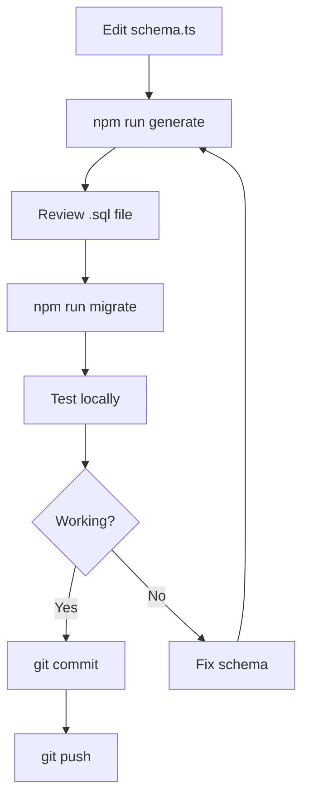

# Database Migrations Guide

This guide explains how to work with database migrations in the LAN Nexus Server project using Drizzle ORM.

## 📋 Overview

We use **Drizzle ORM** for database schema management and migrations. All schema changes are tracked through migration files stored in the `drizzle/` directory.

## 🗂️ File Structure

```
drizzle/
├── meta/
│   ├── _journal.json           # Migration history/journal
│   └── 0000_snapshot.json      # Schema snapshots
└── 0000_clean_bruce_banner.sql # Migration SQL files
```

**Important:** The `drizzle/` folder is now tracked in git (removed from `.gitignore`). This ensures migrations are version-controlled and available in CI/CD.

## 🔧 Common Tasks

### 1. Making Schema Changes

When you need to modify the database schema:

```bash
# Step 1: Edit the schema file
# File: src/server/db/schema.ts

# Step 2: Generate migration files
npm run generate

# Step 3: Review the generated SQL in drizzle/
# Check the newly created .sql file

# Step 4: Apply the migration locally
npm run migrate

# Step 5: Test your changes
npm run dev

# Step 6: Commit the migration files
git add drizzle/
git commit -m "Add migration for [feature name]"
```

### 2. Adding a New Table

Example: Adding a `notifications` table

```typescript
// In src/server/db/schema.ts

export const notificationsTable = mysqlTable('notifications', {
  id: serial().primaryKey(),
  userId: int('user_id').notNull(),
  message: text('message').notNull(),
  read: int('read').notNull().default(0),
  createdAt: datetime('created_at').notNull(),
});
```

Then run:
```bash
npm run generate
npm run migrate
```

### 3. Adding a Column to Existing Table

```typescript
// In src/server/db/schema.ts

export const usersTable = mysqlTable('users_table', {
  id: serial().primaryKey(),
  name: varchar({ length: 255 }).notNull(),
  // ... existing columns ...
  lastLogin: datetime('last_login'), // ← New column
});
```

Then run:
```bash
npm run generate
npm run migrate
```

### 4. Modifying Column Properties

```typescript
// Before:
email: varchar({ length: 100 }).notNull(),

// After:
email: varchar({ length: 255 }).notNull().unique(),
```

```bash
npm run generate
npm run migrate
```

## 🎯 Available Commands

### `npm run generate`
Generates migration files based on schema changes.

```bash
npm run generate
```

**What it does:**
- Compares current schema with last snapshot
- Creates new migration SQL file
- Updates meta/_journal.json
- Creates new snapshot

**Output:**
```
drizzle/0001_new_migration.sql
drizzle/meta/0001_snapshot.json
```

### `npm run migrate`
Applies pending migrations to your database.

```bash
npm run migrate
```

**What it does:**
- Connects to your database (using DATABASE_URL)
- Executes pending migration SQL files
- Records applied migrations in `__drizzle_migrations` table

### `npm run generate:undo`
Drops the last migration (use with caution!).

```bash
npm run generate:undo
```

**Warning:** Only use this for migrations you haven't committed yet!

### `npm run studio`
Opens Drizzle Studio for visual database management.

```bash
npm run studio
```

Opens browser at `http://localhost:4983`

### `npm run update`
User-facing command to apply migrations in production.

```bash
npm run update
```

This is what users run when updating their installation.

### `npm run version`
Check migration status.

```bash
npm run version
```

Shows applied vs pending migrations.

## 🔄 Migration Workflow

### Development Flow



### CI/CD Flow

When you push a tag (e.g., `v1.0.0`):

1. GitHub Actions runs
2. Generates migrations (ensures latest)
3. Copies `drizzle/` to release build
4. Creates `server-build.zip` with migrations included
5. Users download and run `npm run update`

## ⚠️ Important Rules

### DO ✅

- **Always commit migration files** - They're part of your code
- **Test migrations locally first** - Before pushing
- **Review generated SQL** - Ensure it does what you expect
- **Keep migrations small** - One feature per migration when possible
- **Use descriptive names** - Drizzle auto-generates, but you can see the purpose in SQL
- **Document breaking changes** - In commit messages and release notes

### DON'T ❌

- **Never modify existing migrations** - Create new ones instead
- **Don't delete migration files** - They're permanent history
- **Don't skip migrations** - Always apply in order
- **Don't ignore .sql files in git** - They must be tracked
- **Don't apply migrations manually** - Use `npm run migrate`

## 🐛 Troubleshooting

### "No schema changes detected"

```bash
npm run generate
# No schema changes detected
```

**Solution:** You haven't made any changes to `schema.ts`, or the changes don't affect the database structure.

### "Migration already applied"

```bash
npm run migrate
# Error: Migration already applied
```

**Solution:** The migration is already in your database. Check with:
```bash
npm run version
```

### "Cannot connect to database"

```bash
npm run migrate
# Error: Cannot connect to database
```

**Solutions:**
1. Check your `.env` file has correct `DATABASE_URL`
2. Ensure MySQL/MariaDB is running
3. Verify credentials are correct
4. Test connection: `mysql -u user -p`

### "Conflicting migrations"

If you and another developer both create migrations:

```bash
# Pull latest changes
git pull

# Regenerate if needed
npm run generate

# Apply all migrations
npm run migrate
```

### "Schema drift detected"

Your database doesn't match the schema.

```bash
# Option 1: Generate new migration
npm run generate
npm run migrate

# Option 2: Reset database (DANGER: loses data!)
# Drop and recreate database, then:
npm run install
```

## 📊 Migration Naming

Drizzle auto-generates migration names like:
- `0000_clean_bruce_banner.sql`
- `0001_powerful_iron_man.sql`
- `0002_crazy_thor.sql`

The number prefix ensures order. The name is auto-generated but doesn't affect functionality.

## 🔍 Inspecting Migrations

### Check what's in a migration

```bash
cat drizzle/0001_*.sql
```

### Check migration status

```bash
# Using our version script
npm run version

# Or directly query database
mysql -u root -p -e "SELECT * FROM lan_nexus.__drizzle_migrations;"
```

### View migration journal

```bash
cat drizzle/meta/_journal.json
```

## 🚀 Production Deployment

When deploying a new version:

1. **Build includes migrations:**
   - GitHub Actions copies `drizzle/` to release
   - Migrations are in `server-build.zip`

2. **Users run updater:**
   ```bash
   npm run update
   ```

3. **Updater applies migrations:**
   - Detects pending migrations
   - Shows what will be applied
   - Executes migrations
   - Confirms success

## 🔐 Best Practices

### 1. Backup Before Migration

Always backup before applying migrations in production:

```bash
mysqldump -u root -p lan_nexus > backup_$(date +%Y%m%d_%H%M%S).sql
```

### 2. Test in Staging

If possible, test migrations in a staging environment first.

### 3. Reversible Migrations

When possible, make migrations reversible:

```sql
-- Adding a column (reversible)
ALTER TABLE users ADD COLUMN last_login DATETIME;

-- Removing a column (NOT reversible - data loss!)
ALTER TABLE users DROP COLUMN email;
```

### 4. Data Migrations

For data transformations, consider:

```sql
-- Good: Add column with default
ALTER TABLE users ADD COLUMN status VARCHAR(20) DEFAULT 'active';

-- Better: Add column, then update in batches
ALTER TABLE users ADD COLUMN status VARCHAR(20);
UPDATE users SET status = 'active' WHERE last_login > NOW() - INTERVAL 30 DAY;
UPDATE users SET status = 'inactive' WHERE status IS NULL;
```

### 5. Index Management

Add indexes for performance:

```typescript
export const usersTable = mysqlTable('users_table', {
  id: serial().primaryKey(),
  email: varchar({ length: 255 }).notNull().unique(),
  clientId: varchar('client_id', { length: 255 }).notNull(),
}, (table) => ({
  clientIdIdx: index('client_id_idx').on(table.clientId),
}));
```

## 📚 Additional Resources

- **Drizzle ORM Docs:** https://orm.drizzle.team/
- **Drizzle Kit Docs:** https://orm.drizzle.team/kit-docs/overview
- **MySQL Reference:** https://dev.mysql.com/doc/

## 🆘 Getting Help

If you encounter issues:

1. Check this guide
2. Review error messages carefully
3. Check `drizzle/meta/_journal.json` for migration history
4. Use `npm run version` to see status
5. Consult Drizzle ORM documentation
6. Ask the team

## 📝 Example: Complete Feature Addition

Let's say you want to add user preferences:

```typescript
// 1. Add to schema.ts
export const userPreferencesTable = mysqlTable('user_preferences', {
  id: serial().primaryKey(),
  userId: int('user_id').notNull(),
  theme: varchar('theme', { length: 20 }).default('dark'),
  notifications: int('notifications').default(1),
});

export const userPreferencesRelations = relations(userPreferencesTable, ({ one }) => ({
  user: one(usersTable, {
    fields: [userPreferencesTable.userId],
    references: [usersTable.id],
  }),
}));
```

```bash
# 2. Generate migration
npm run generate

# 3. Check the generated SQL
cat drizzle/0003_*.sql

# 4. Apply migration
npm run migrate

# 5. Verify in database
npm run studio

# 6. Test in your app
npm run dev

# 7. Commit
git add drizzle/ src/server/db/schema.ts
git commit -m "Add user preferences table"
git push
```

---

**Remember:** Migrations are like commits for your database - once applied and pushed, they're permanent!